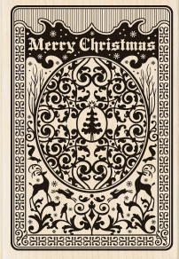

# Blackjack Game
---
#### Objective:
create a blackjack game implementing object oriented programming (OOP) in javascript
#### Live Demo:

[Xmas Blackjack Game] (http://iamclamclam.com/xmasblackjack/)

#### Languages used:

* HTML
* CSS
* Javascript
* jQuery

#### Authors:
Carolyn Lam

#### How to Play:

###### Game Rules
The goal is to beat the dealer with a better hand (meaning a hand totaling more than the dealer's hand, but not more than 21). The best hand the player can make is with any face card and an ace card, which would give the player 21 points (otherwise known as blackjack). If the player or the dealer's points total more than 21, then whoever reached that amount is automatically busted and loses the game. The dealer must also have at least 17 points by the end of the game. If the dealer's first two cards do not total at least 17, then the dealer must keep drawing more cards until reaching a minimum of 17 points.

1. Click on the deal button to get started (give the player and dealer 2 cards each. The dealer's 2nd drawn card does not show the face side. This card is known as the dealer's hole card. It will be shown later.)

  

2. Click on the hit button to draw another card (the choice is yours)

  
3. Click on the stand button when you do not want to draw anymore cards. If you've reached this point, that means you haven't busted and neither you or the dealer got a blackjack. Let's find out who wins. Also, at this point, the dealer's hole card is revealed. If the dealer's total points is below 17, then the dealer must draw more cards until reaching a minimum of 17

  

4. Click on the reset button to begin a new game

  

#### Sample Code:

- Below shows some of the methods that the Deck Constructor has

```
// Create Deck Constructor
function Deck() {
  this.currentDeck = [];
}

// generate a new deck of cards
// store in into currentDeck
Deck.prototype.newDeck = function() {
  for (var i = 0; i < 4; i++) {
    var suit = {
      0: 'hearts',
      1: 'diamonds',
      2: 'clubs',
      3: 'spades'
    }
    for (var k = 1; k <= 13; k++) {
      this.currentDeck.push(new Card( k, suit[i]) );
    }
  }
}

Deck.prototype.deal = function(handSelector, currentPlayerHand, hole) {
  var cardImg = "";
  var text = "";

  // draw the first card from the deck
  var myCard = this.draw();

  // add the card to the current player's hand
  currentPlayerHand.cards.push(myCard);

  // check if the current deal is a dealer hole card or not
  if (!hole) {
    cardImg = '';
    text = currentPlayerHand.getPoints();
  } else {
    cardImg = '';
    text = '???';
  }

  // render the image on the page
  $("#"+ handSelector +"-hand").append(cardImg);

  // update the current player's point count that is being displayed
  $('#' + handSelector + '-points').text(text);

}
```
- Below shows some of the methods that the Game Constructor has

```
// Create Game Constructor
function Game() {
  this.myDeck = new Deck();
  this.dealerHand = new Hand();
  this.playerHand = new Hand();
}

Game.prototype.deal = function() {
  // once the deal button has been clicked, undisable the other buttons
  $("#hit-button").prop('disabled', false);
  $("#stand-button").prop('disabled', false);
  $("#reset-button").prop('disabled', false);

  // generate a new deck of cards
  this.myDeck.newDeck();

  // shuffle the deck
  this.myDeck.shuffle();

  // deal 4 times => order: Player, Dealer, Player, Dealer
  this.myDeck.deal('player', this.playerHand);
  this.myDeck.deal('dealer', this.dealerHand);
  this.myDeck.deal('player', this.playerHand);
  this.myDeck.deal('dealer', this.dealerHand, 'hole');

  // check if dealer or player gets blackjack
  this.blackjackAnyone();

  // disable the deal button once everyone has been dealt 2 cards each
  $("#deal-button").prop('disabled', true);
}

Game.prototype.revealDealerHoleCard = function() {
  // remove dealer's hole card (back image)
  $('#dealer-hole-card').remove();

  // add dealer's hole card (front image)
  $('#dealer-hand').append('');

  // update dealer's points to display current points
  $('#dealer-points').text(this.dealerHand.getPoints());
}
```
