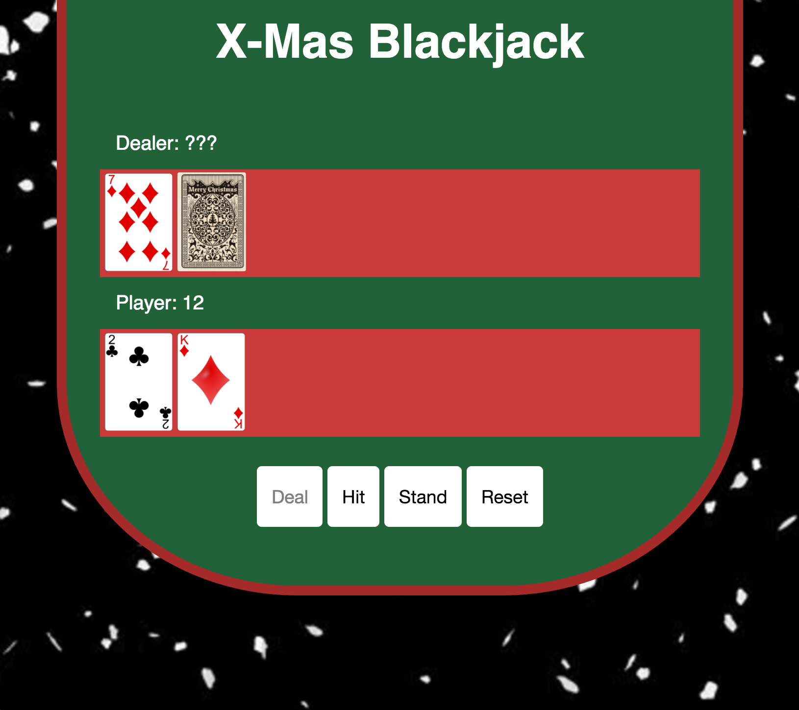
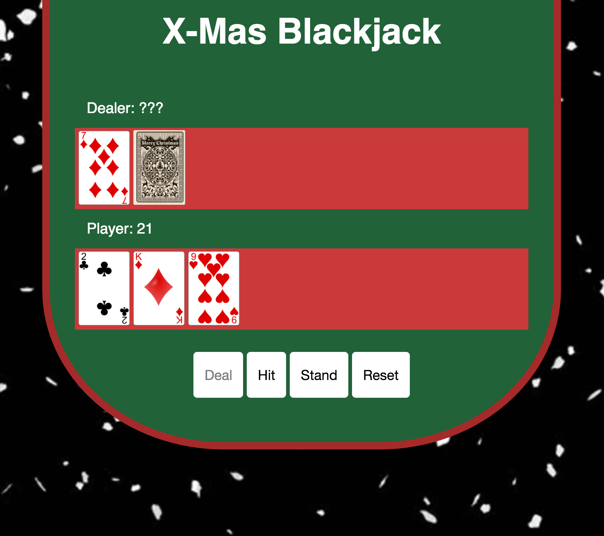
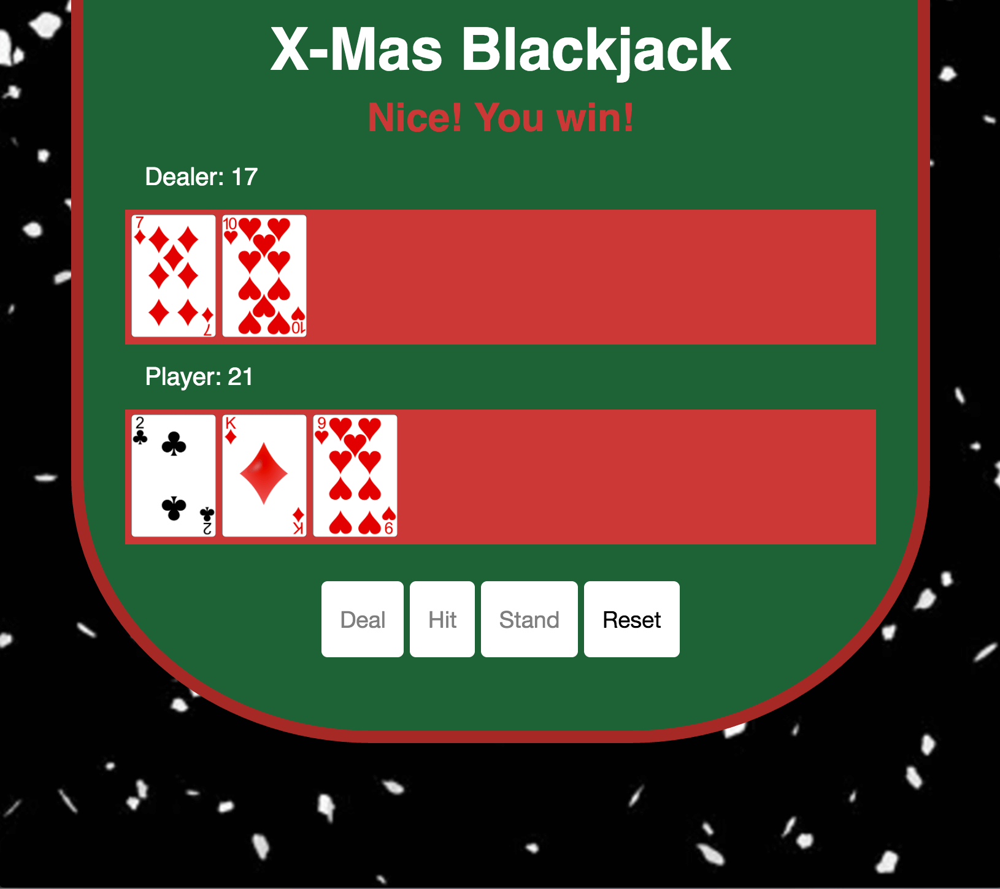
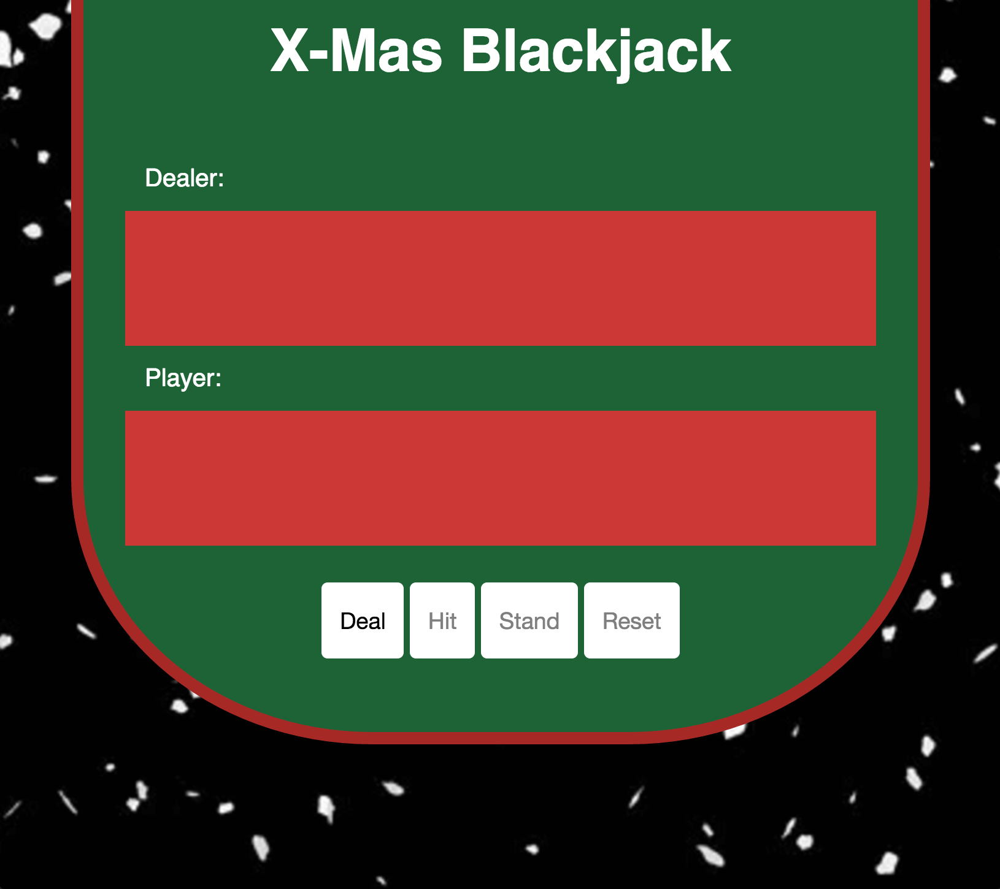

# Blackjack Game
---
#### Objective:
create a blackjack game implementing object oriented programming (OOP) in javascript
#### Live Demo:

[Xmas Blackjack Game] (http://xmasblackjack.surge.sh/)

#### Languages used:

* HTML
* CSS
* Javascript
* jQuery

#### Authors:
Carolyn Lam

#### How to Play:

###### Game Rules
The goal is to beat the dealer with a better hand (meaning a hand totaling more than the dealer's hand, but not more than 21). The best hand the player can make is with any face card and an ace card, which would give the player 21 points (otherwise known as blackjack). If the player or the dealer's points total more than 21, then whoever reached that amount is automatically busted and loses the game. The dealer must also have at least 17 points by the end of the game. If the dealer's first two cards do not total at least 17, then the dealer must keep drawing more cards until reaching a minimum of 17 points.

1. Click on the deal button to get started (give the player and dealer 2 cards each. The dealer's 2nd drawn card does not show the face side. This card is known as the hole card. It will be shown later.)
2. Click on the hit button to draw another card (the choice is yours)
3. Click on the stand button when you do not want to draw anymore cards
4. Click on the reset button to begin a new game

#### Screenshots

1. Deal 

2. Hit

3. Stand

4. Reset

